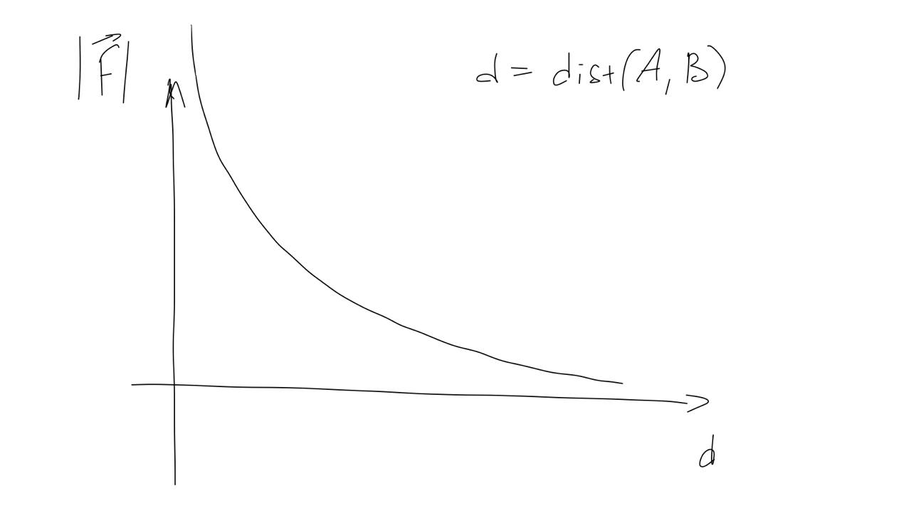
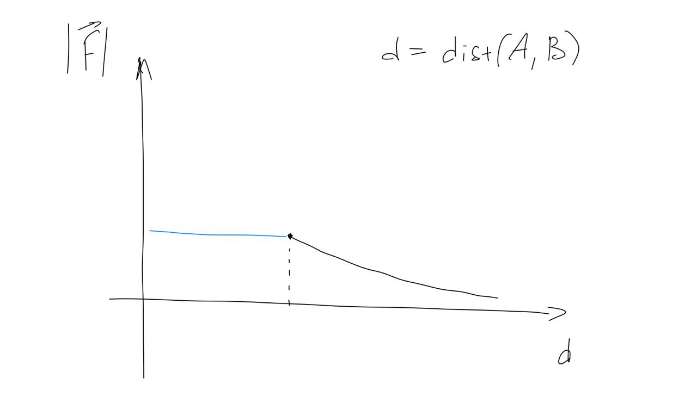
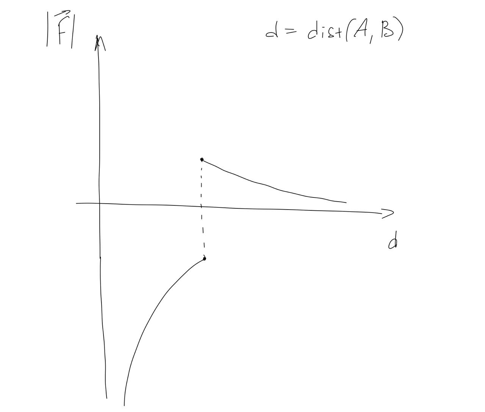
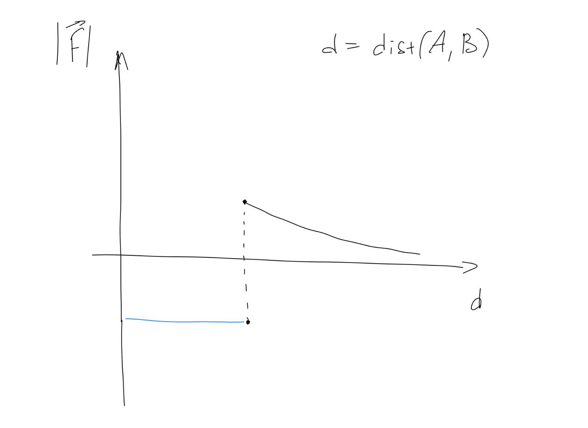
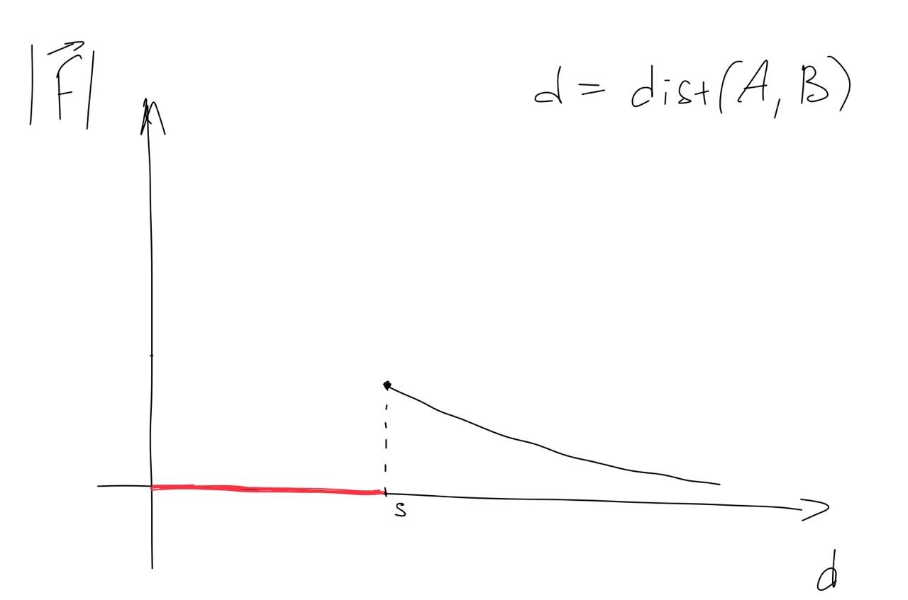
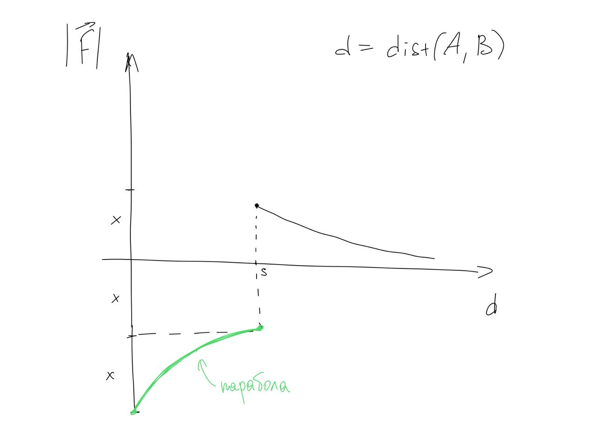

# Функции гравитации

## gravity()
Просто гравитация по закону всемирного тяготения двух тел с массой 1 кг.

## cut_gravity()
Гравитация, обрезанная константой по порогу _STOP_RADIUS_

## gravity_with_sign()
Гравитация, отражённая относительно Ox по порогу _STOP_RADIUS_. Мотивация в том, чтобы тела останавливались относительно друг друга на расстоянии _STOP_RADIUS_

## cut_gravity_with_sign()
Гравитация, обрезанная константой, причём константная часть отрицательная. Это ещё одна попытка заставить тела останавливаться на расстоянии _STOP_RADIUS_.

## zeroed_gravity()
Гравитация, обрезанная нулем по _STOP_RADIUS_.

## smooth_gravity_with_sign()
Если расстояние больше _STOP_RADIUS_, то обычная гравитация. Иначе зелёная парабола с рисунка. 
