# Дополнение для AutoCAD

## Назначение программы
Программа предназначена для покрытия кругами заданного пользователем радиуса многоугольников (полилиний) в приложении AutoCAD.
Пользователю предоставляется графический интерфейс, содержащий четыре алгоритма для решения этой задачи. Пользователь должен задать радиус кругов в тех же единицах измерения, в которых построен его чертёж в запущенном окне приложения AutoCAD, а также указать другие параметры выбранного им алгоритма. После нажатия кнопки запуска алгоритма пользователю нужно выбрать полилинию (или несколько полилиний) и нажать Enter. После завершения работы алгоритма покрытие отразится на чертеже.

Программа может применяться инженерами по пожарной безопасности, работающими в приложении AutoCAD под операционной системой Windows.

## УСЛОВИЯ ВЫПОЛНЕНИЯ ПРОГРАММЫ
### Минимальный состав аппаратурных средств
Минимальные требования к оборудованию пользователя, необходимые для корректной работы программы при штатной нагрузке:
2) Процессор 2,5–2,9 ГГц;
3) 1 ГБ свободной оперативной памяти;
4) 500 Мб дискового пространства;

### Минимальный состав программных средств
На компьютере должна быть установлена операционная система Windows 11 или Windows 10 версии 1809 и выше и приложение AutoCAD версии 2022 или новее.

## ВЫПОЛНЕНИЕ ПРОГРАММЫ
### Загрузка
Распакуйте архив fireman.zip с помощью пароля «fireman» (см рис. 1).

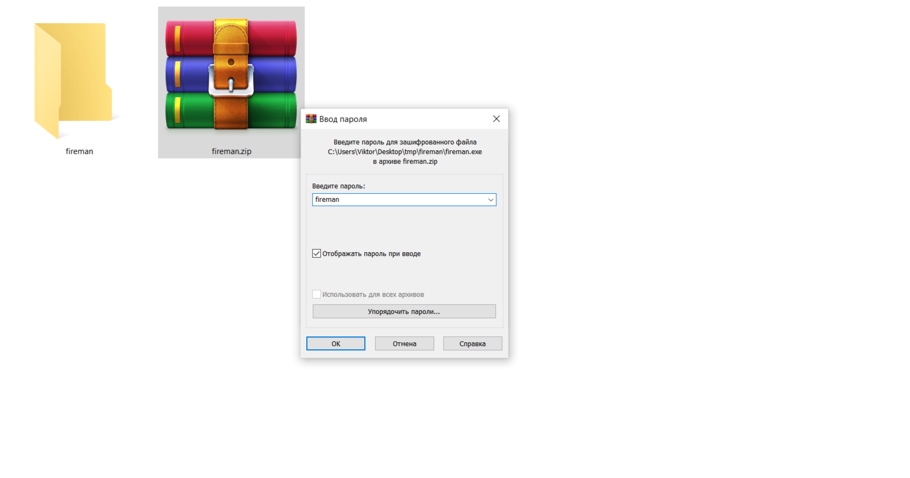 

### Запуск
Перейдите в извлечённую из архива папку fireman и запустить файл fireman.exe (см рис. 2). 

Через несколько секунд появится окно приложения «Дополнение для AutoCAD». Вы будете находиться на Главной странице (см рис. 3).
 
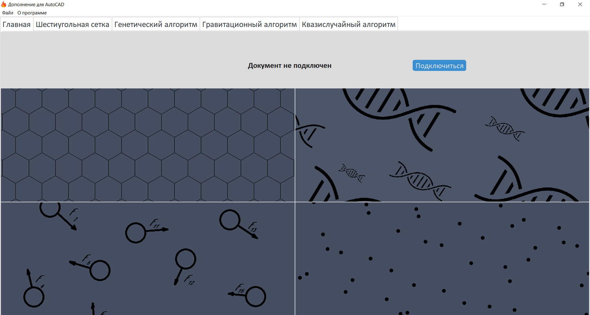

### Выполнение
На рис. 4 и рис. 5 можно ознакомиться с элементами интерфейса главной страницы.
 
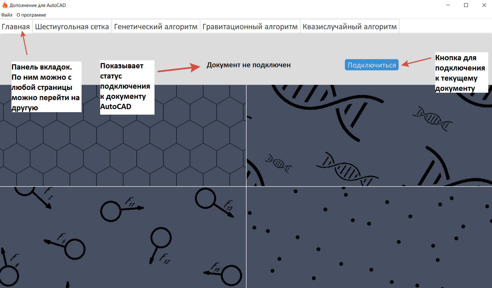

Запустите AutoCAD требуемой версии и откройте нужный чертёж. Перейдите в окно данного Дополнения и нажмите на кнопку «Подключиться». В статусе подключения отобразится название открытого чертежа (см рис. 6).
 
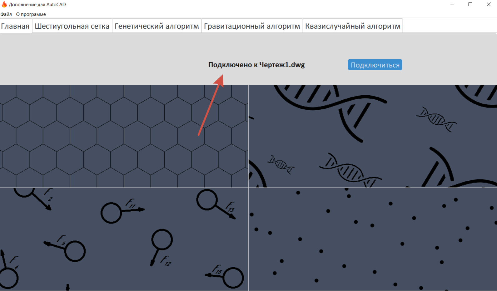

Выберите один из четырёх доступных алгоритмов. Это можно сделать, нажав на соответствующую плитку или нажав на соответствующую вкладку.
Вы окажетесь на странице алгоритма. Познакомиться с виджетами и их назначением можно на рис. 7.
 
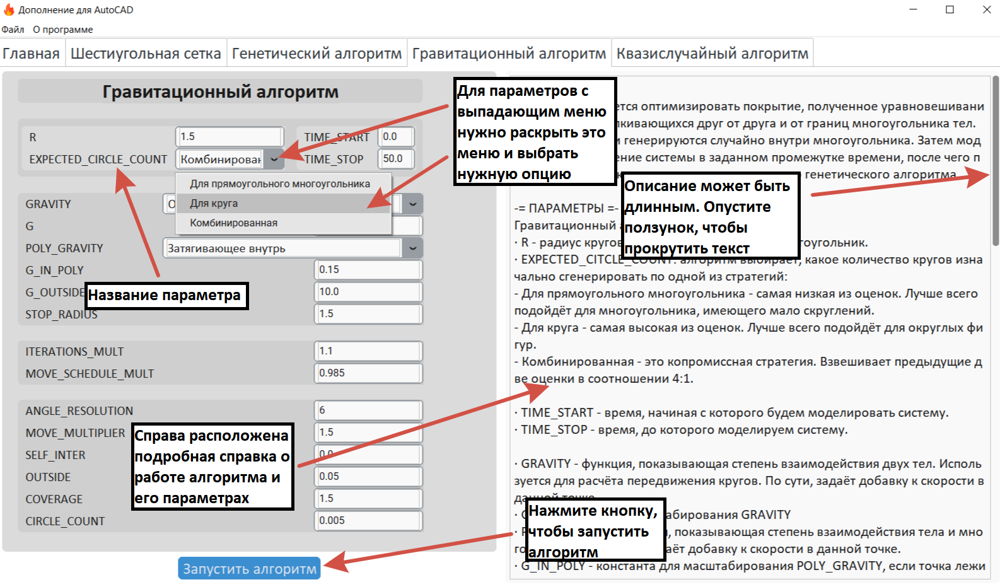

Введите необходимые Вам параметры в соответствии с геометрией полилинии, которую нужно покрыть, и нажмите кнопку «Запустить алгоритм». Далее перейдите в окно AutoCAD. Приложение запросит у вас выделить полилинию (полилинии). Это может выглядеть так, как показано на рис. 8. 

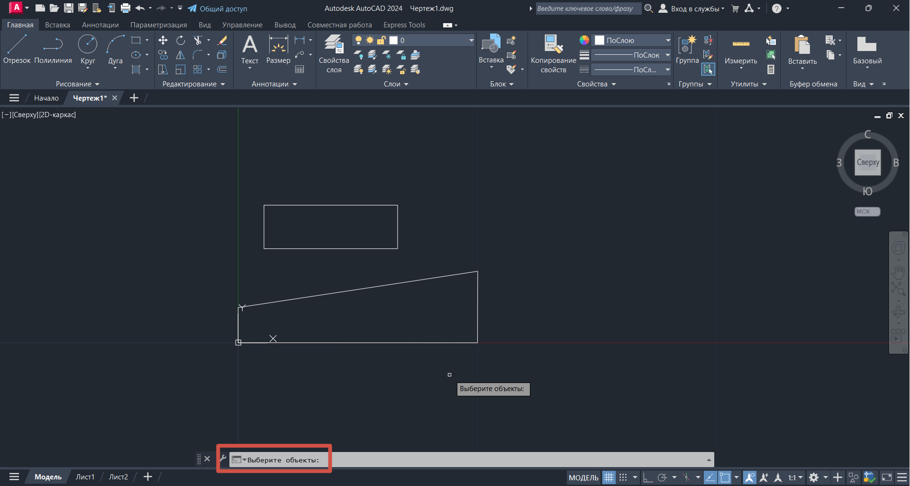

Выделите необходимую полилинию и нажмите клавишу Enter. Алгоритм начал свою работу. Когда он завершится, на чертеже отобразится полученное покрытие. Это может выглядеть так, как показано на рис. 9. 
 
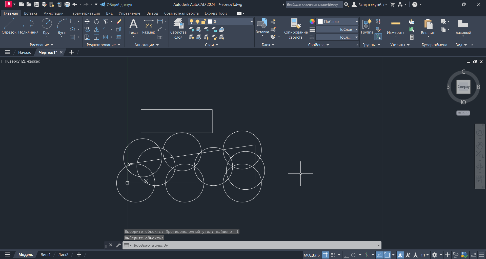

### Многоугольник с отверстиями и круги
Следует отметить, что алгоритм может работать не только с полилиниями, но и с кругами. Кроме того, алгоритм способен покрывать многоугольник с отверстиями. Чтобы задать такой многоугольник, просто выберите полилинию (или круг), соответствующий внешней границе, и полилинии (или круги), соответствующие отверстиям. Пример покрытия полилинии с отверстиями смотрите на рис. 10.

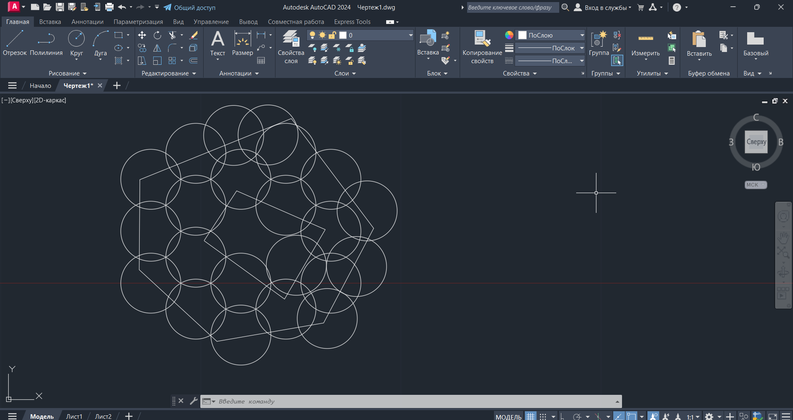

### Сохранение настроек
Дополнение поддерживает импорт и экспорт настроек алгоритмов с помощью файла, а также сохранение параметров алгоритмов по умолчанию.

Чтобы загрузить настройки из файла, выберите в строке меню Файл -> Открыть (см рис. 11).
 
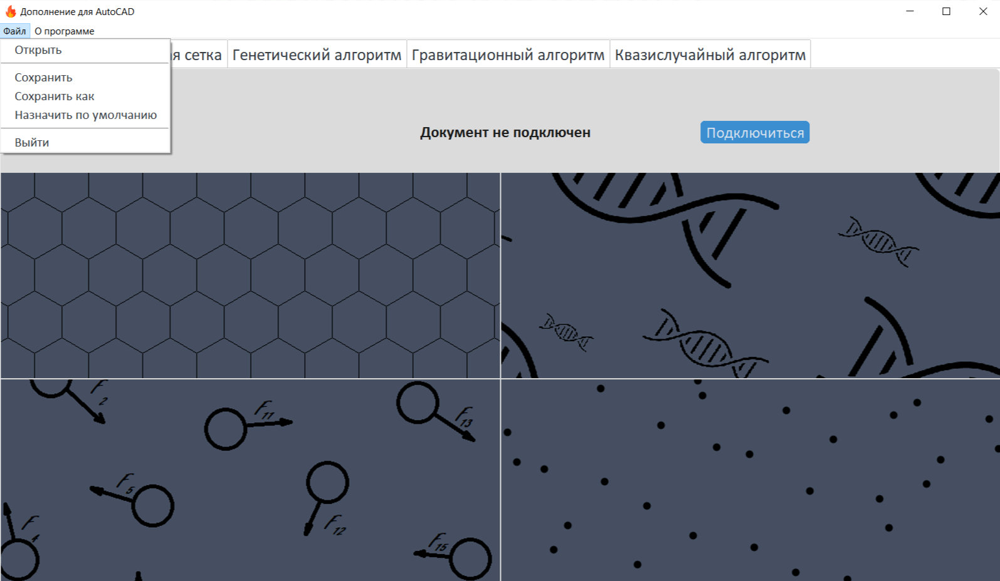

Откроется диалоговое окно выбора файла. Необходимо выбрать JSON-файл, имеющий определённую структуру (см рис. 12).

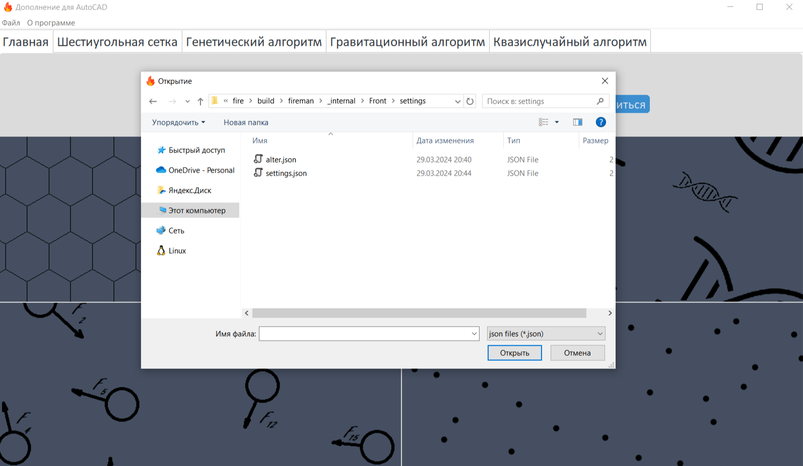

Чтобы сохранить настройки в последнем открытом файле, выберите Файл -> Сохранить.
Если Вы хотите назначить настройки из открытого файла по умолчанию, выберите пункт Файл -> Назначить по умолчанию. После перезапуска приложения отобразятся именно они.
Чтобы сохранить текущие настройки в отдельный файл, выберите Файл -> Сохранить как. Откроется диалоговое окно, в котором нужно выбрать путь и ввести название JSON-файла (см. рис. 13).
 
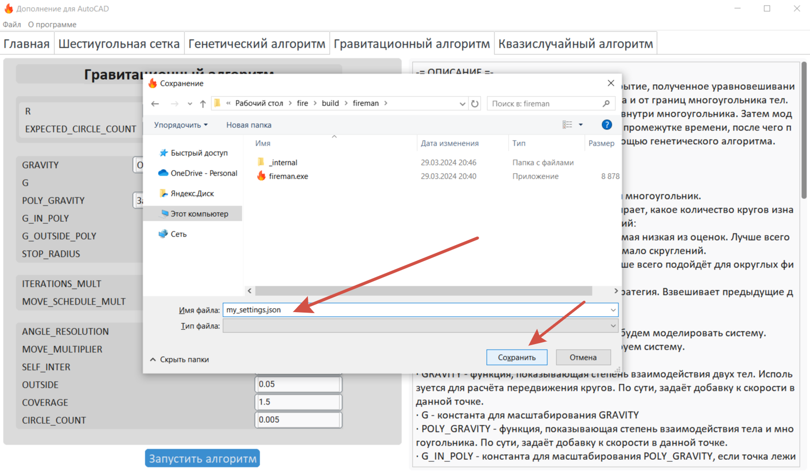

### Завершение программы
Завершение работы программы может производиться двумя способами: через пункт строки меню Файл -> Выйти; нажатием на кнопку «Крестик» в правом верхнем углу (см рис. 14)

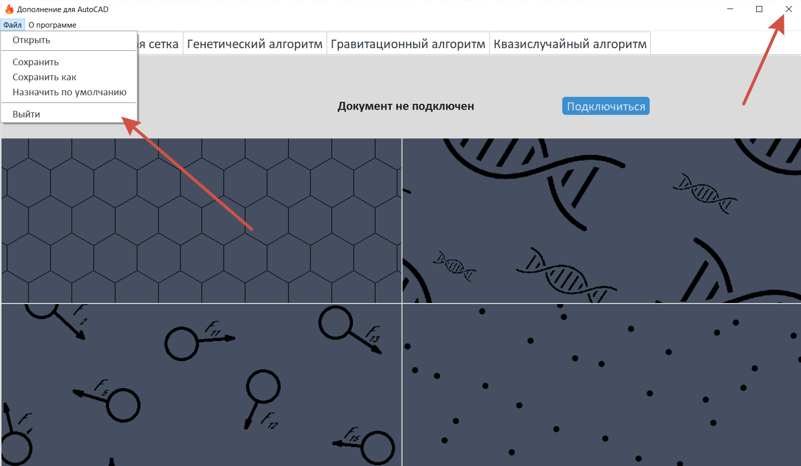

## Описание функций
### Шестиугольная сетка
Этот алгоритм предназначен для покрытия многоугольников с помощью метода шестиугольной сетки. Он хорошо покрывает симметричные фигуры правильной формы, габариты которых не сильно отличаются от чисел вида R*k.
Также после метода можно попробовать оптимизировать количество кругов. Есть два алгоритма: жадный и генетический.
    Алгоритм принимает следующие параметры: 
1)  R – радиус кругов, которыми покрывается многоугольник;
2)  ALPHA_RESOLUTION – сколько разных углов от 0 до π/3 будет перебирать алгоритм;
3)  RESOLUTION – сколько сдвигов будет перебирать алгоритм.
Алгоритмы оптимизации количества кругов:
1)  «Жадный алгоритм» оставляет круги, центры которых лежат внутри многоугольника. Из оставшихся берёт только те, что имеют достаточно большое пересечение с многоугольником;
2)  «Генетический алгоритм» пытается максимизировать площадь покрытия и минимизировать площадь кругов вне многоугольника, а также суммарную площадь попарного пересечения кругов.
Рекомендуемые значения:
1)  ALPHA_RESOLUTION, RESOLUTION следует брать примерно равными 1-3;
2)  алгоритмы оптимизации заметно увеличивают время работы; генетический алгоритм в среднем работает лучше жадного, но дольше.
Примечание: это самый быстрый из реализованных алгоритмов. Однако он может создавать лишние круги на границе многоугольника.
### Генетический алгоритм
Этот метод пытается оптимизировать построенное методом шестиугольной сетки покрытие с помощью метрики. Метрика поощряет особь за большую площадь покрытия и наказывает за большое количество кругов, большое попарное их пересечение и выходы за пределы многоугольника.
Параметры алгоритма:
1)  R – радиус кругов, которыми покрывается многоугольник;
2)  ALPHA_RESOLUTION – сколько разных углов от 0 до π/3 будет перебирать алгоритм;
3)  RESOLUTION – сколько сдвигов будет перебирать алгоритм.
Генетический алгоритм состоит из двух стадий: с приоритетом на удаление и перемещение кругов. В каждой стадии количество итераций пропорционально количеству кругов n. 
4)  int(ITERATION_MULT_DELETION * n) – количество итераций на стадии удаления кругов;
5)  int(ITERATION_MULT_MOVING * n) – количество итераций на стадии перемещения кругов.
Алгоритм затрагивает только "внешние" круги. 
6)  INNER BOUND – начиная с этого слоя по удалению от внешних границ многоугольника круг считается "внутренним";
7)  MOVE_SCHEDULER_MULT – какая доля от скорости перемещения кругов остаётся после каждой итерации (то есть, алгоритм должен более аккуратно двигать круги на поздних стадиях).
Создание особей:
8)  ANGLE_RESOLUTION – в скольких направления будут создаваться особи;
9)  MOVE_MULTIPLIER – множитель расстояния, на которое может сдвинуться особь.
Метрика, которую оптимизирует алгоритм, состоит из четырёх параметров:
10) SELF_INTER – важность попарного пересечения кругов (чем чаще круги накладываются друг на друга, тем меньше метрика);
11) OUTSIDE – важность того, какая часть площади кругов лежит за границей многоугольника;
12) COVERAGE – важность того, какой процент многоугольника покрыт;
13) DEL_CIRCLE_COUNT – важность количества кругов (на этапе удаления);
14) CIRCLE_COUNT – важность количества кругов (на этапе перемещения).
Рекомендованные значения:
1)  ALPHA_RESOLUTION, RESOLUTION не стоит брать большими, 1-3 вполне достаточно;
2)  ITERATION_MULT_DELETION = 0.3-0.4;
3)  ITERATION_MULT_MOVING = 1-2;
4)  INNER BOUND = 2;
5)  MOVE_SCHEDULER_MULT = 0.985;
6)  ANGLE_RESOLUTION = 6;
7)  MOVE_MULTIPLIER = 1.5;
8)  SELF_INTER = 0;
9)  OUTSIDE = 0.05;
10) COVERAGE = 1.5;
11) DEL_CIRCLE_COUNT = 0.1;
12) CIRCLE_COUNT = 0.005.
Примечание: это довольно результативный метод. Однако, он может требовать больше времени, чем другие.
### Гравитационный алгоритм
Этот метод пытается оптимизировать покрытие, полученное уравновешиванием системы отталкивающихся друг от друга и от границ многоугольника тел. Изначально круги генерируются случайно внутри многоугольника. Затем моделируется поведение системы в заданном промежутке времени, после чего происходит корректировка покрытия с помощью генетического алгоритма.
Параметры алгоритма. Гравитационная часть:
1)  R – радиус кругов, которыми покрывается многоугольник;
2)  EXPECTED_CITCLE_COUNT: алгоритм выбирает, какое количество кругов изначально сгенерировать по одной из стратегий:
•   «Для прямоугольного многоугольника» – самая низкая из оценок; лучше всего подойдёт для многоугольника, имеющего мало скруглений;
•   «Для круга» – самая высокая из оценок; лучше всего подойдёт для округлых фигур;
•   «Комбинированная» — это компромиссная стратегия; взвешивает предыдущие две оценки в соотношении 4:1.
3)  TIME_START – время, начиная с которого будем моделировать систему;
4)  TIME_STOP – время, до которого моделируем систему;
5)  GRAVITY – функция, показывающая степень взаимодействия двух тел; используется для расчёта передвижения кругов; по сути, задаёт добавку к скорости в данной точке;
6)  G – константа для масштабирования GRAVITY;
7)  POLY_GRAVITY – функция, показывающая степень взаимодействия тела и многоугольника; по сути, задаёт добавку к скорости в данной точке;
8)  G_IN_POLY – константа для масштабирования POLY_GRAVITY, если точка лежит внутри многоугольника;
9)  G_OUTSIDE_POLY – константа для масштабирования POLY_GRAVITY, если точка лежит вне многоугольника.
На больших расстояниях сила притяжения/отталкивания объектов принимается прямо/обратно пропорциональной квадрату расстояния.
10) STOP_RADIUS – если два тела (тело и граница многоугольника) находятся ближе этого расстояния друг от друга, то степень их взаимодействия начинает вычисляться по ограниченной формуле (обратно квадратичная формула даёт очень большой прирост скорости на маленьких расстояниях);
Параметры алгоритма. Генетическая часть:
11) int(ITERATION_MULT * k) – максимальное количество итераций генетического алгоритма, где k – количество сгенерированных в начале алгоритма кругов;
12) MOVE_SCHEDULER_MULT – какая доля от скорости перемещения кругов остаётся после каждой итерации (то есть, алгоритм должен более аккуратно двигать круги на поздних стадиях).
Создание особей:
13) ANGLE_RESOLUTION – в скольких направления будут создаваться особи;
14) MOVE_MULTIPLIER – множитель расстояния, на которое может сдвинуться особь.
Метрика, которую оптимизирует генетический алгоритм, состоит из четырёх параметров:
15) SELF_INTER – важность попарного пересечения кругов (чем чаще круги накладываются друг на друга, тем меньше метрика);
16) OUTSIDE – важность того, какая часть площади кругов лежит за границей многоугольника;
17) COVERAGE – важность того, какой процент многоугольника покрыт;
18) CIRCLE_COUNT – важность количества кругов (на этапе перемещения).
Рекомендуемые параметры:
1)  EXPECTED_CIRCLE_COUNT = «Комбинированная»;
2)  TIME_START = 0;
3)  TIME_STOP = 50 (между временем моделирования и временем работы линейная зависимость);
4)  GRAVITY = «Ограниченное отталкивание»;
5)  G = 0.2;
6)  POLY_GRAVITY = «Затягивающее внутрь»;
7)  G_IN_POLY = 0.15;
8)  G_OUTSIDE_POLY = 10;
9)  STOP_RADIUS = R;
10) ITERATION_MULT = 1-1.1;
11) MOVE_SCHEDULER_MULT = 0.985;
12) ANGLE_RESOLUTION = 6;
13) MOVE_MULTIPLIER = 1.5;
14) SELF_INTER = 0;
15) OUTSIDE = 0.05;
16) COVERAGE = 1.5;
17) DEL_CIRCLE_COUNT = 0.1;
19) CIRCLE_COUNT = 0.005;
Примечание: это довольно результативный метод. На маленьких фигурах он справляется в среднем лучше остальных. Тем не менее, довольно часто он может требовать больше времени.
### Квазислучайный алгоритм
Этот метод пытается оптимизировать покрытие, полученное уравновешиванием системы отталкивающихся друг от друга и от границ многоугольника тел. Круги генерируются квазислучайно равномерно по площади многоугольника с помощью последовательности Гальтона (Halton sequence). Затем моделируется поведение системы в заданном промежутке времени.
Параметры алгоритма. Этап генерации:
1)  R – радиус кругов, которыми покрывается многоугольник;
2)  EXPECTED_CITCLE_COUNT: алгоритм выбирает, какое количество кругов изначально сгенерировать по одной из стратегий:
•   «Для прямоугольного многоугольника» – самая низкая из оценок; лучше всего подойдёт для многоугольника, имеющего мало скруглений;
•   «Для круга» – самая высокая из оценок; лучше всего подойдёт для округлых фигур;
•   «Комбинированная» — это компромиссная стратегия; взвешивает предыдущие две оценки в соотношении 4:1;
3)  MARGIN – круги генерируются в минимальном описанном для данного многоугольника прямоугольнике; однако в таком случае круги редко (слишком часто) оказываются у границ; чтобы исправить это, можно сместить наружу (внутрь) каждую границу описанного прямоугольника на MARGIN;
4)  P1 – параметр последовательности Гальтона для оси x;
5)  P2 – параметр последовательности Гальтона для оси у;
6)  START – с какого члена последовательности начинать;
7)  STEP – шаг, с которым брать члены последовательности.
Параметры алгоритма. Этап расстановки:
8)  TIME_START – время, начиная с которого будем моделировать систему;
9)  TIME_STOP – время, до которого моделируем систему;
10) GRAVITY – функция, показывающая степень взаимодействия двух тел; используется для расчёта передвижения кругов; по сути, задаёт добавку к скорости в данной точке;
11) G – константа для масштабирования GRAVITY;
12) POLY_GRAVITY – функция, показывающая степень взаимодействия тела и многоугольника; по сути, задаёт добавку к скорости в данной точке;
13) G_IN_POLY – константа для масштабирования POLY_GRAVITY, если точка лежит внутри многоугольника;
14) G_OUTSIDE_POLY – константа для масштабирования POLY_GRAVITY, если точка лежит вне многоугольника.
На больших расстояниях сила притяжения/отталкивания объектов принимается прямо/обратно пропорциональной квадрату расстояния.
15) STOP_RADIUS – если два тела (тело и граница многоугольника) находятся ближе этого расстояния друг от друга, то степень их взаимодействия начинает вычисляться по ограниченной формуле (обратно квадратичная формула даёт очень большой прирост скорости на маленьких расстояниях).
Рекомендуемые значения:
1)  EXPECTED_CIRCLE_COUNT = «Комбинированная»;
2)  MARGIN = 0 (или другое число из \[-R; R\]);
3)  P1 = 2;
4)  P2 = 3.
P1 и P2 нужно брать взаимно простыми примерно одного порядка (либо пропорционально сторонам многоугольника, если он имеет вытянутую по одной оси форму).
5)  START = 1 (любое удобное число);
6)  STEP = 1 (или простое, не равное P1 и P2);
7)  TIME_START = 0;
8)  TIME_STOP = 50 (между временем моделирования и временем работы линейная зависимость);
9)  GRAVITY = «Ограниченное отталкивание»;
10) G = 0.2;
11) POLY_GRAVITY = «Затягивающее внутрь»;
12) G_IN_POLY = 0.15;
13) G_OUTSIDE_POLY = 10;
14) STOP_RADIUS = R.
Это метод может быстрее и лучше остальных покрывать маленькие области, близкие к квадратным. Однако, его покрытия нужно чаще поправлять вручную.

# СООБЩЕНИЯ ОПЕРАТОРУ
## Критическая ошибка
В случае критической ошибки, не позволившей программе запуститься корректно, пользователь увидит окно, содержащее текст ошибки и рекомендации (см. рис. 15). Рекомендуется переустановить программу. Если проблема не решится, обратиться к разработчику.
 
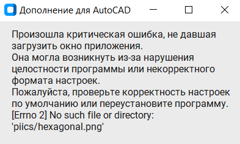

## Не удалось подключиться к чертежу
Ошибка «Не удалось подключиться к чертежу» (см рис. 16) может возникать, если оператор:
1)  не запустил приложение AutoCAD;
2)  не открыл в нём чертёж;
3)  не завершил какую-либо операцию в приложении;
4)  делает запросы слишком часто.
Для пункта 3) рекомендуется нажать в приложении AutoCAD клавишу Esc и повторить попытку.

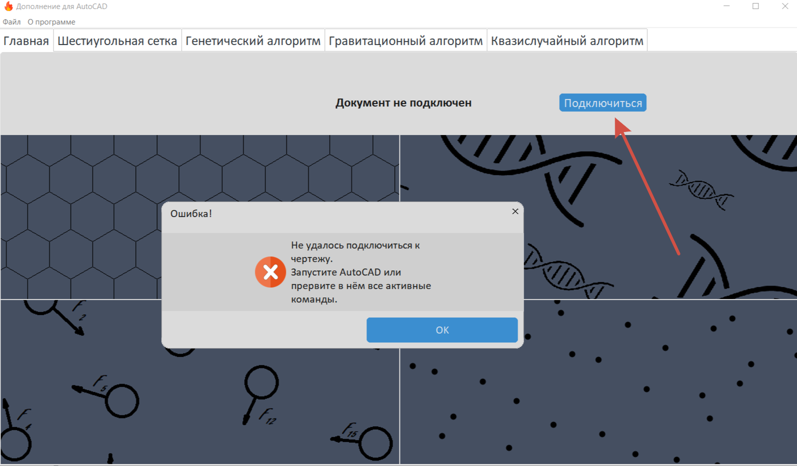

## Не удалось получить многоугольники
Ошибка «Не удалось получить многоугольники» (см. рис. 17) возникает, если оператор:
1)  не завершил какую-либо операцию в приложении;
2)  не выбрал ни одну полилинию или круг.
Для пункта 1) рекомендуется нажать в приложении AutoCAD клавишу Esc и повторить попытку.
 
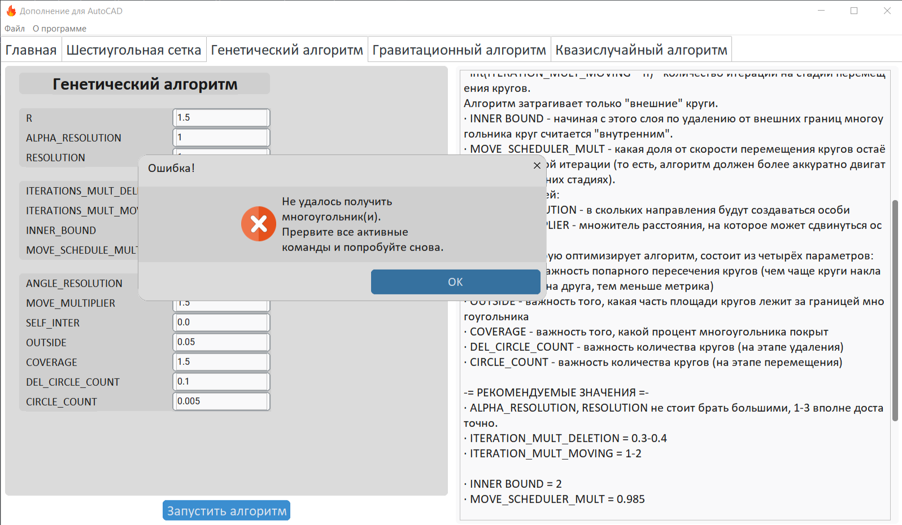

## Не удалось привести параметр к типу
Ошибка этого типа (см. рис. 18) возникает, когда оператор:
1)  ввёл некорректные данные в параметры алгоритма;
2)  попытался открыть файл с некорректными параметрами.
В обоих случаях следует проверить соответствие введённого значения указанной в ошибке переменной требуемому типу данных.
 
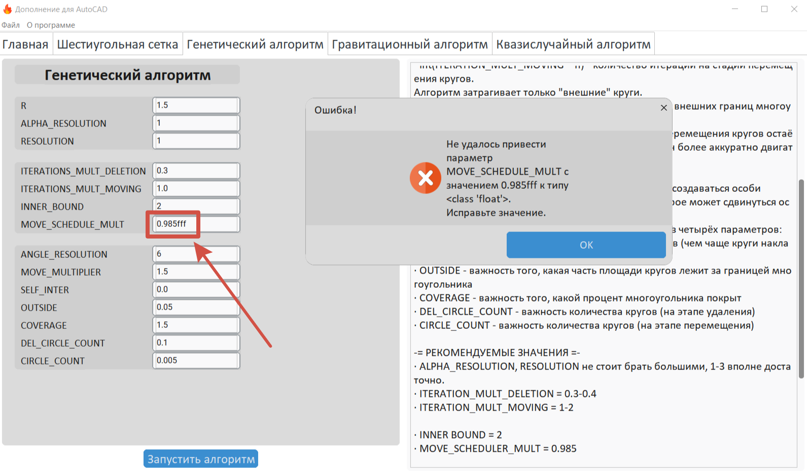

